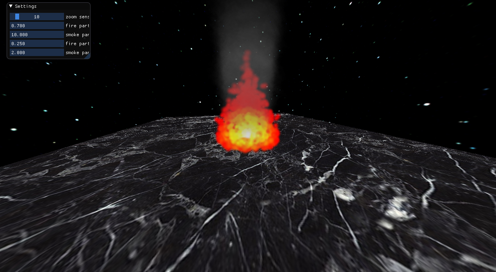

# 3d object

## Requirements

- 3.3 core profile
- prereqs - conan, cmake
- deps - glfw, glew, imgui, glm, stb, tinyobjloader
- run.cmd/run.sh

## How to execute

1. ./build.sh

2. cd build

3. ./fire_and_smoke_run

## Examples

